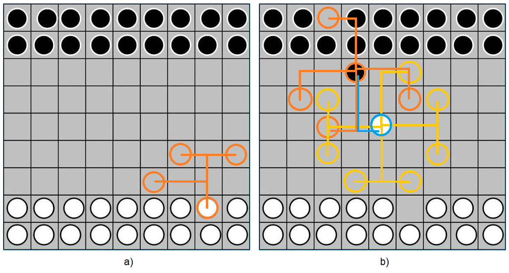
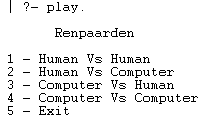
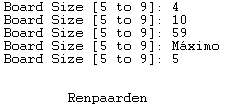
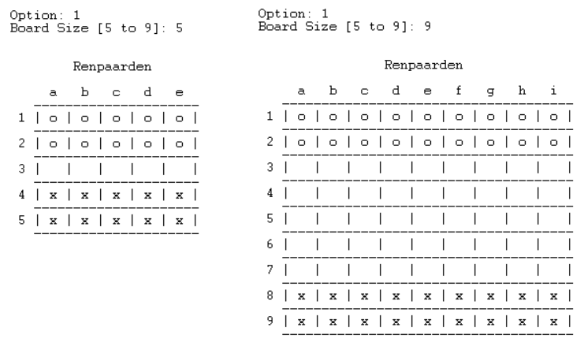
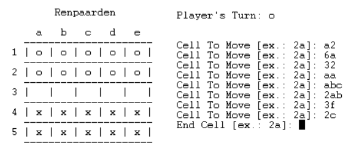
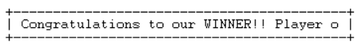

# PFL_TP2_T7_Repaarden5

Project for the Functional and Logical Programming course @ FEUP - 2021/2022

Implementation of the game Reenparden in Prolog.

**Grade:** 19.6

## Identificação

**Jogo** : Renpaarden

**Grupo** (T7_Repaarden5): 

| Número mecanográfico | Nome Completo                    | Contribuição |
| :------------------- | :------------------------------- | :----------: |
| 201906852            | Henrique Ribeiro Nunes           | 50 %         |
| 201905427            | Patricia do Carmo Nunes Oliveira | 50 %         |

<br>

## Instalação e Execução

Para além da instalação do SICStus Prolog 4.7, não é necessário instalar ou configurar mais nenhuma ferramenta de forma a executar o jogo, tanto em *Linux* como em *Windows*.

<br>

## Descrição do jogo

Renpaarden é um jogo de tabuleiro, jogado, por norma, num quadrado 9x9. Cada jogador possui 18 pedras brancas ou pretas. O jogo começa com as 18 pedras de cada jogador distribuídas por duas linhas em lados opostos do tabuleiro.


### Objetivo

O objetivo de cada jogador é atravessar o tabuleiro com cada uma das pedras e colocá-las nas posições originais das pedras do jogador adversário.


### Regras

Alternadamente, a cada turno, um jogador apenas pode mover uma pedra. O movimento desta pedra deverá ser em forma de **'L'**, semelhante ao movimento de um cavalo num jogo de xadrez, movendo 2 casa num determinado sentido ortogonal, seguido de 1 casas na direção perpendicular ao mesmo. Este movimento deverá terminar sempre numa casa vazia, diretamente, por um único movimento, ou a partir de saltos consecutivos usando, para isso, as pedras do adversário. Não existe a possibilidade de capturar pedras do adversário.



*Legenda:*

a) Movimento simples de uma `pedra branca` a partir dos possíveis **'L'**

b) Movimento de uma `pedra preta` pelos possíveis **'L'** diretos e **'L'** que se obtêm pelo salto na pedra do branca


### Ligações usadas na recolha de informação

- [Board Game Geek - Renpaarden](https://boardgamegeek.com/boardgame/70925/renpaarden)
- [Board and Pieces - Renpaarden](https://sites.google.com/site/boardandpieces/list-of-games/renpaarden)
- [Renpaarden Board Game](http://www.di.fc.ul.pt/~jpn/gv/renpaarden.htm)

<br>

## Lógica do Jogo

O predicado de início de jogo é ***play/0***.


### 1. Representação interna do estado do jogo

O estado do jogo (*GameState*) é representado internamente da forma `Board-Player` onde `Board` corresponde a uma matriz de valores no conjunto *{0, 1, 2}* e `Player` corresponde ao jogador ao qual pertence a jogada atual, sendo assim um elemento do conjunto *{1, 2}*, onde *1* corresponde ao jogador 1 e *2* ao jogador 2. O `Board` é uma lista de listas que contém o mesmo número de colunas e de linhas. Uma célula com o valor *0* corresponde a uma célula vazia do tabuleiro, uma célula com o valor *1* ou *2* significa que o jogador 1 ou o jogador 2, respetivamente, possui uma pedra naquela posição.

Uma representação possível para um estado de jogo inicial seria:

```prolog
[[ 1, 1, 1, 1, 1, 1, 1 ],
 [ 1, 1, 1, 1, 1, 1, 1 ]
 [ 0, 0, 0, 0, 0, 0, 0 ],
 [ 0, 0, 0, 0, 0, 0, 0 ],
 [ 0, 0, 0, 0, 0, 0, 0 ],
 [ 2, 2, 2, 2, 2, 2, 2 ],
 [ 2, 2, 2, 2, 2, 2, 2 ]]-1
```

Uma representação possível para um estado de jogo intermédio seria:

```prolog
[[ 2, 0, 2, 1, 2, 2, 0 ],
 [ 1, 0, 2, 2, 0, 2, 2 ],
 [ 0, 0, 1, 1, 0, 0, 1 ],
 [ 1, 2, 0, 0, 0, 0, 2 ],
 [ 0, 0, 1, 2, 0, 0, 0 ],
 [ 2, 0, 2, 0, 1, 2, 1 ],
 [ 1, 0, 1, 0, 1, 1, 1 ]]-2
```

Uma representação possível para um estado de jogo final seria:

```prolog
[[ 2, 2, 2, 2, 2, 2, 2 ],
 [ 2, 2, 2, 2, 2, 2, 2 ],
 [ 0, 0, 0, 1, 0, 0, 0 ],
 [ 1, 0, 0, 0, 1, 0, 0 ],
 [ 0, 0, 0, 1, 0, 0, 1 ],
 [ 0, 1, 1, 1, 0, 1, 0 ],
 [ 1, 1, 1, 0, 1, 0, 1 ]]-1
```

Cada jogador tem uma representação interna própria de acordo com o seu tipo: *human-0* para os jogadores humanos e *pc-Level* para os computadores, onde *Level* varia entre *1* e *2* de acordo com o nível do jogador artificial.


### 2. Visualização do estado de jogo

O jogo é iniciado com a visualização do menu principal (`show_initial_menu/0`), que nos dá a opção de escolher o tipo de jogo pretendido entre os seguintes disponíveis: Humano Vs Humano, Humano Vs Computador, Computador Vs Humano e Computador Vs Computador, como demonstrado na imagem seguinte.



De acordo com a opção escolhida, o utilizador é questionado pelos seguintes parâmetros: tamanho do tabuleiro, e, no caso de ter escolhido uma opção que envolvia o computador, pelo nível de inteligência dos computadores em jogo. 

Em cada uma das interações com o utilizador são verificados e validados os valores introduzidos pelo mesmo, de forma a questioná-lo repetidamente até obter um valor considerado vádido em cada contexto. Por exemplo, só são aceites tamanhos de tabuleiro que se incluam entre o mínimo e máximo possível, neste caso 5 e 9, respetivamente (`ask_board_size(-Size)`). Da mesma forma que apenas são aceites o nível 1 ou 2 para inteligência de um computador (`ask_ai_level(-Level, +Text)`). 



É então construído (`initial_state(+Size, -GameState)`) e visualizado (`display_game(+GameState)`) o tabuleiro de acordo com o tamanho pretendido. De notar que todas as funções de visualização são fléxiveis uma vez que têm em conta este parâmetro, adaptando-se a qualquer tamanho do tabuleiro. Até o título do jogo é centrado de acordo com esta variável.

~~~prolog
display_banner(Size, Title) :- 
  S is Size*4 + 7,
  nl, format('~t ~w ~t~*|~n~n', [Title, S]).
~~~



Como é possível verificar na figura anterior, na visualização de um tabuleiro as pedras do jogador 1, representadas internamente por *1*, são desenhadas como 'o' e as pedras do jogador 2, representadas internamente por *2*, como 'x', já as casas vazias, representadas internamente por *0*, são desenhadas como ' ', deixando um espaço em branco. Esta tradução é internamente obtida pelo cabeçalho `cell_code/2`.

Seguir-se-á um ciclo de jogo que mostra no ecrã o estado de jogo e o jogador atual, questionando-o sobre o movimento que pretende realizar, no caso de se tratar de um jogador Hunano, ou realizando o movimento computado e escolhido, no caso de se tratar de uma jogada a ser realizada pelo computador. Mais uma vez, a interação com o jogador humano é validada pelo que apenas são aceites coordenadas no formato de **LinhaColuna (ex.: 2a)** e que estejam dentro dos limites do tamanho do tabuleiro (`ask_coord(+Text, +Size, -Cell)`), não realizando qualquer verificação da validade do movimento escolhido nesta parte de acordo com as regras do jogo. O utilizador é repetidamente questionado até se verificar uma resposta válida por parte do mesmo.



Este ciclo de jogo alternará entre jogador 1 e jogador 2 até algum destes vencer o jogo. Quando a vitória é alcançada por um dos jogadores, e uma vez que o empate neste jogo não é possível, será visualizada uma mensagem de fim de jogo a anunciar o vencedor (`congratulate(+Winner)`) e o jogo terminará, como ilustrado na seguinte imagem, quando o vencedor é o jogador 1.




### 3. Execução de Jogadas

Uma jogada é definida por uma célula inicial e uma célula final (`Cell-EndCell`) e cada célula é definida por uma linha e uma coluna (`Row-Col`). A célula inicial deve corresponder à pedra que o jogador pretende movimentar e a célula final deve corresponder à posição no tabuleiro onde o jogador pretende que a pedra seja colocada. Cada jogador, na sua vez, deverá escolher a sua jogada (`choose_move(+GameState, +PlayerType, -Cell-EndCell)`) e de seguida essa jogada será encaminhada para ser validada de acordo com as regras do jogo (`move(+GameState, +Move, -NewGameState)`) e se for uma jogada válida, então é executada, alterando o estado de jogo (os efeitos da jogada são visualizados no novo tauleiro e o turno é atualizado para o jogador oponente). Caso contrário é feito novamente o pedido de uma jogada. 

Na validação da jogada são verificadas as seguintes condições: 
  - a pedra que o jogador pretende mover pertence-lhe (`belongs_to(?Player, ?Cell, +Board)`); 
  - a célula final está vazia (`empty_cell(+Cell, +Board)`);
  - a movimentação desejada é válida (`valid_move(+Player, +Cell, ?EndCell, +Board)`), isto quer dizer:
    - o movimento desejado tem a forma de *L* (`horse_move(+Cell, ?NewCell)`);
    - ou é possível chegar até à célula final com movimentos em *L* através do oponente. Para isso é verificado recursivamente se, com um movimento em *L*, se chega a uma célula do oponente ou à célula final vazia desejada, marcando as células de forma a não as visitar novamente.
  

### 4. Final do Jogo 

O jogo termina quando um dos jogadores consegue mover todas as suas pedras para o lado do adversário de forma a ocupar as 2 linhas do lado do tabuleiro oposto ao que começou.

Assim, após a realização de uma jogada, se algum dos jogadores envolvidos, o atual ou o seu oponente, verificar a condição acima dá-se o jogo como terminado e anuncia-se o vencedor.

Na verificação da situação de fim de jogo é aplicada a seguinte lógica (`game_over(+GameState, -Winner)`):
- Jogador 1 ganha se todas as células das últimas 2 linhas do tabuleiro tiverem o valor *1*, ou seja se não existir nenhuma célula nas 2 primeiras linhas do **reverso do tabuleiro** cujo valor não seja *1* (`check_win(1, Board)`);
- Jogador 2 ganha se todas as células das 2 primeiras linhas do tabuleiro tiverem o valor *2*, ou seja se não existir nenhuma célula nas 2 primeiras linhas do **tabuleiro** cujo valor não seja *2* (`check_win(2, Board)`);


### 5. Lista de Jogadas Válidas

A obtenção da lista com jogadas possíveis para o computador é realizada pelo predicado `valid_moves(+GameState, -ListOfMoves)`. 

Neste predicado são computados todos os movimentos possíveis de realizar apartir de cada uma das células que pertence ao jogador. Ou seja, para cada célula que pertence ao jogador (`belongs_to(?Player, ?Cell, +Board)`) são encontradas todas as células finais cujo movimento resultaria num movimento válido (`valid_move(+Player, +Cell, ?EndCell, +Board)`) e com esta informação são então construídos todos os pares `Cell-EndCell` e agrupados, com este formato, numa lista sem repetidos que representa todos os movimento possíveis de realizar.

De relembrar que um movimento também aqui é considerado válido se corresponder a um salto de cavalo, incluindo o uso de células do adversário como intermediárias.


### 6. Avaliação do Estado do Jogo

O estado de jogo é útil ser avaliado quando é pretendido que a IA jogue de forma mais inteligente do que apenas aleatoriamente. Para isso, o estado de jogo é avaliado (`value(+GameState, +Player, -Value)`) de forma a que um *GameState* tenha um menor valor quanto melhor for para o jogador atual. Assim, dependendo do jogador atual, é atribuido um peso a cada linha do tabuleiro (i.e. dado um tabuleiro 5x5, e sendo o jogador atual o jogador 1 - recorde-se que o objetivo do jogador 1 é ocupar as linhas inferiores do tabuleiro -, a linha superior do tabuleiro teria um peso de *4* e a linha inferior um peso de *0*. No caso do jogador 2, a linha superior do tabuleiro teria um peso de *0* e a linha inferior um peso de *4*). De seguida, são contadas as pedras pertencentes ao jogador atual que se encontram na linha. O valor de cada linha é obtido multiplicando o número de pedras do jogador presentes na linha pelo peso da linha para o próprio. O valor do tabuleiro é obtido somando o valor de todas as linhas do tabuleiro.

Desta forma, a avaliação ideal de um tabuleiro será *0\*Size + 1\*Size = Size*, onde Size corresponde ao tamanho do tabuleiro. Esta avaliação corresponde ao estado final do tabuleiro para o jogador atual. Quanto maior for a avaliação do estado de jogo, mais longe estará o jogador atual de vencer o jogo.


### 7. Jogada do Computador

A escolha da jogada a efetuar pelo computador depende do nível de dificuldade escolhido (`choose_move(+GameState, +Level, -Move)`) da seguinte forma: 
- No nível 1 o computador computa todos os movimentos possíveis de realizar devolvendo uma jogada válida aleatória;
- No nível 2 o computador computa todos os movimentos possíveis de realizar avaliando para cada um destes o estado de jogo que resultaria, devolvendo assim a melhor jogada no momento, sendo esta aquela a que corresponde um estado de jogo de menor valor (quanto menor o valor melhor o tabuleiro), tomando partido da ordenação da função `setof`. De forma a diminuir a previsibilidade deste jogador perante várias jogadas de valor mínimo igual é devolvida uma jogada válida aleatória dentro deste grupo.


<br>

## Conclusões

Com este trabalho foi nos possível aprofundar os temas lecionados em aula com um carisma mais didático e num projeto de maiores dimensões que requeria a assimilação de uma vasta gama de conceitos variados e interligação entre os mesmos. Outro dos fatores essenciais passou também pelo esforço na organização do projeto devido à grande quantidade de predicados relacionados e a necessidade de manter a execução do jogo eficiente.

### Limitações (*Known issues*)

Segmentação excessiva de alguns predicados, como por exemplo, no predicado `valid_moves/2`, onde possivelmente existiria uma forma de implementação mais direta e eficiente, mas na nossa prespestiva a versão implementada é a mais percetível a nível de fluxo de execução e significado dos predicados usados.

### Melhorias (*Roadmap*)

Implementação de um nível 3 de inteligência do computador que tem em conta a avaliação da situação de jogo em profundidade e não apenas após a jogada realizada no momento.

<br>

## Bibliografia

- Slides disponibilizados em aula 
- [SWI-Prolog library - lists](https://www.swi-prolog.org/pldoc/man?section=lists)
- [SWI-Prolog library - random](https://www.swi-prolog.org/pldoc/man?section=random)
- [SWI-Prolog Control Predicater - repeat](https://www.swi-prolog.org/pldoc/man?predicate=repeat/0)
- [ASCII Table](https://pt.wikipedia.org/wiki/ASCII)
